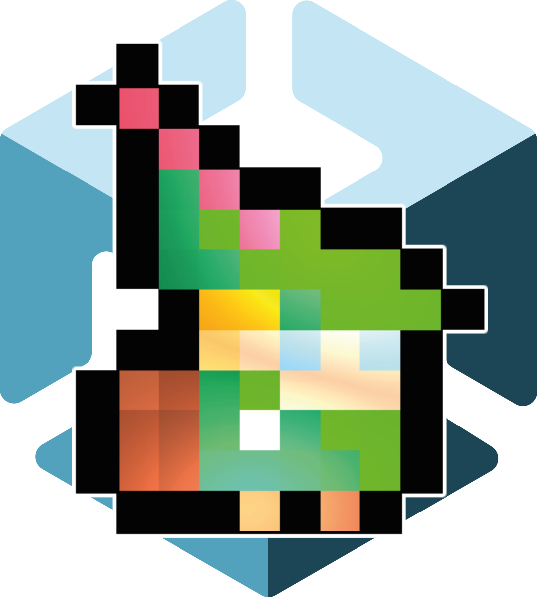

 
 <!-- ------------- B A C K P A C K M A G E ------------- -->

 

#   

   

- 📌 Downloads  
- 📌 Live Demo der *WebGL* Applikation
    > (gehostet auf *GitHub Pages*)

  > ######  *Die <ins>ausführbaren Anwendungen</ins>, die zum Download bereitgestellt sind, sind <ins>der WebGL Version gegenüber</ins> zu <ins>bevorzugen</ins>, da noch nicht alle Features vollständig auf die Benutzung mit WebGL optimiert sind. 

 |                                                                                   | Version             |   Platform  | *tested on*                      |  
 | :-------------------------------------------------------------------------------- | ------------------: | :---------: | :------------------------------- | 
 | | | | |  
 | **[ ▶️ Browser-Game 👈🏼 ](https://ixi-enki.github.io/backpackmage-webgl/0.1.0/)** |  v0.1.0  |    🌐 ***WebGl***    |  *Brave, Opera, Chrome, Firefox*  |
 | | | | |  
 | **[ 💾 Download .exe ]( https://github.com/IxI-Enki/backpackmage-webgl/blob/master/downloads/backpackmage-0.0.8-windows.x86_64.7z )** |  v0.0.8  | ***Windows*** | *Native Windows 11* |  
 | **[ 💾 Download .x86_64 ]( https://github.com/IxI-Enki/backpackmage-webgl/blob/master/downloads/backpackmage-0.0.8-linux.x86_64.7z )** |  v0.0.8  | ***Linux*** | *Native Kali, Native Arch* |  
 | **[ 💾 Download .apk ]( https://github.com/IxI-Enki/backpackmage-webgl/blob/master/downloads/backpackmage-0.0.8-android.apk )** |  v0.0.8  | ***Android*** | *Native Android* |  
 | **[ 💾 Download .ios ]( https://github.com/IxI-Enki/backpackmage-webgl/blob/master/downloads/backpackmage-0. )** |  v0.0.8  | ***Apple*** | *🆘 leider nicht möglich* |  
 | | | | |  

---

## 📝 *Zur Dokumentation geht's* [ hier❗ ](https://github.com/IxI-Enki/backpackmage)

*
  made 2025 by  <b> 𓂍 ꂅnki 𓂍 </b>  Jan 
*

<!-- ------------------- 𓂍 ꂅnki 𓂍 -------------------- -->
